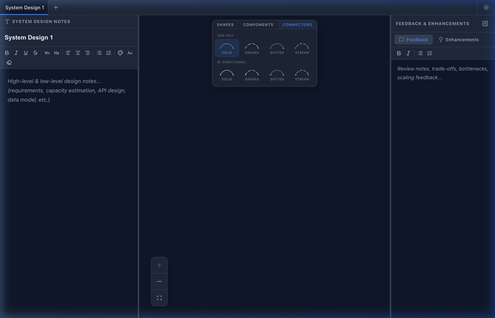

# Freetext — System Design Canvas

A modern, interactive system design tool built with **React** and **React Flow**. Sketch system architectures with drag-and-drop components, connect them with customizable connectors, and document your designs with a built-in rich text editor — all in one place.

<p align="center">
  
</p>

## ✨ Features

### 🎨 Canvas

- **Drag & Drop** — Shapes (rectangle, circle, triangle, diamond, hexagon) and system components (server, database, cache, load balancer, CDN, API gateway, and 20+ more)
- **Connectors** — Solid, dashed, dotted, and animated stream styles in both **one-way** and **bi-directional** variants
- **Copy & Paste** — `Cmd+C` / `Cmd+V` to copy-paste selected nodes and their connections; `Cmd+D` to quick-duplicate
- **Color Picker** — Right-click any shape to change its fill color
- **Snap to Grid** — Clean, aligned layouts with 20px snap grid
- **Multi-select** — Hold `Shift` to box-select; hold `Cmd` / `Ctrl` to add to selection
- **Delete** — Select and press `Backspace` / `Delete`

### 📝 Notes Panel

- Built-in **rich text editor** (React Quill) for writing system design notes alongside your diagram
- Supports headings, bold, italic, underline, strikethrough, lists, links, and code blocks

### 💬 Feedback & Enhancements Panel

- Capture feedback and enhancement ideas directly next to your designs

### 🗂️ Tabs

- Work on **multiple designs** in parallel with a tabbed interface
- Each tab has its own independent canvas and notes

### 🌗 Theme

- Toggle between **dark** and **light** mode

## 🚀 Getting Started

### Prerequisites

- [Node.js](https://nodejs.org/) ≥ 18

### Install & Run

```bash
# Clone the repository
git clone https://github.com/drdcs/freetext.git
cd freetext

# Install dependencies
npm install --legacy-peer-deps

# Start the dev server
npm run dev
```

Open [http://localhost:5173/freetext/](http://localhost:5173/freetext/) in your browser.

### Deploy to GitHub Pages

```bash
npm run deploy
```

Live at: **[https://drdcs.github.io/freetext/](https://drdcs.github.io/freetext/)**

## 🛠️ Tech Stack

| Layer        | Technology                                          |
|--------------|-----------------------------------------------------|
| Framework    | [React 19](https://react.dev/)                      |
| Build Tool   | [Vite 7](https://vite.dev/)                         |
| Canvas       | [React Flow 11](https://reactflow.dev/)             |
| Rich Editor  | [React Quill](https://github.com/zenoamaro/react-quill) |
| Icons        | [Lucide React](https://lucide.dev/) + [React Icons](https://react-icons.github.io/react-icons/) |
| Deployment   | [GitHub Pages](https://pages.github.com/) via `gh-pages` |

## 📁 Project Structure

```
src/
├── components/
│   ├── canvas/          # Canvas, nodes, edges, toolbar, color picker
│   ├── editor/          # Rich text editor
│   └── layout/          # App shell, tab bar, side panels
├── context/             # React contexts (tabs, theme)
├── App.jsx              # Root app component
└── main.jsx             # Entry point
```

## ⌨️ Keyboard Shortcuts

| Shortcut              | Action                        |
|-----------------------|-------------------------------|
| `Cmd/Ctrl + C`        | Copy selected nodes           |
| `Cmd/Ctrl + V`        | Paste copied nodes            |
| `Cmd/Ctrl + D`        | Duplicate selected nodes      |
| `Backspace` / `Delete`| Delete selected               |
| `Shift + Drag`        | Box select                    |
| `Cmd/Ctrl + Click`    | Multi-select                  |
| Right-click node      | Open color picker             |

## 📄 License

MIT
